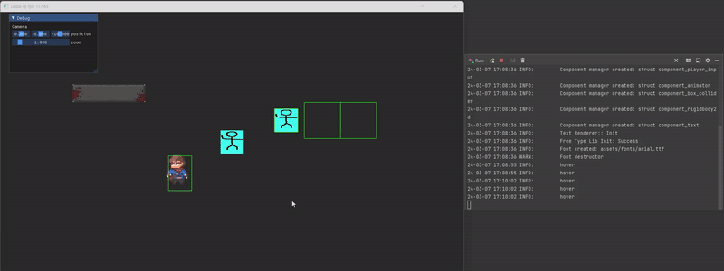

<html>

<body>
  <h1>Dazai Game Engine</h1>
    
A 2D game engine written in C++ and OpenGL with ECS-based architecture.

  
  <h2>Features</h2>
    <ul>
        <li>Purely ECS-based architecture using sparse sets and signature-based components and systems.</li>
        <li>Basic 2D physics with arbitrary rectangle collision detection and resolution.</li>
        <li>Line-box intersection-based Raycast system.</li>
        <li>Update and FixedUpdate support for deterministic physics.</li>
        <li>2D renderer with batching support and custom way of parsing and compiling shaders.</li>
        <li>2D Camera system.</li>
        <li>Debug rendering for colliders and Raycast.</li>
        <li>Sprite sheet-based 2D animation system.</li>
        <li>Modular Mouse/Keyboard input system.</li>
        <li>Modular and flexible Resource manager.</li>
        <li>Easy-to-use scene manager for prewarming and loading levels.</li>
        <li>ImGui Integration for making custom editor UIs and In-Game UIs.</li>
        <li>Sound system.</li>
        <li>Custom general-purpose logger for debugging purposes.</li>
        <li>And some more cool stuff.</li>
    </ul>
    <h2>License</h2>
    
This project is licensed under the MIT License. See the <code>LICENSE</code> file for details.

    <h2>Contact</h2>
    
If you have any questions or suggestions regarding the 2D game engine, feel free to contact me.

</body>
</html
